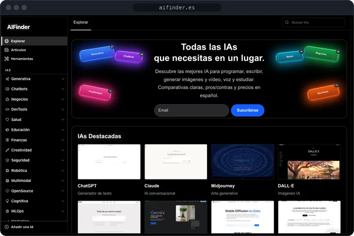
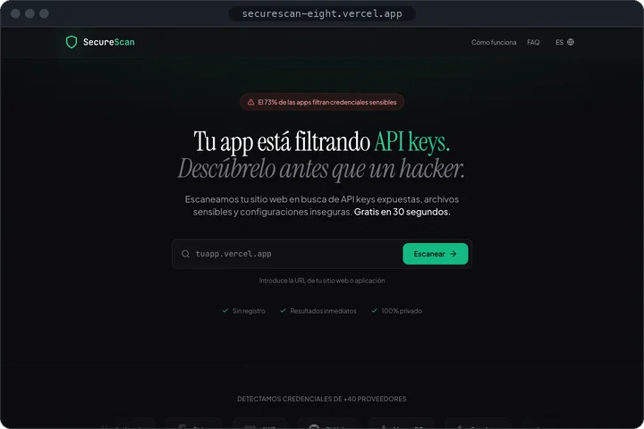
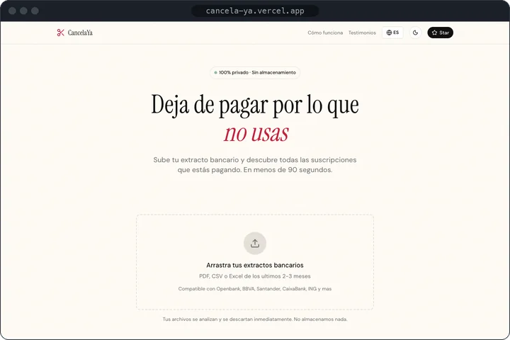
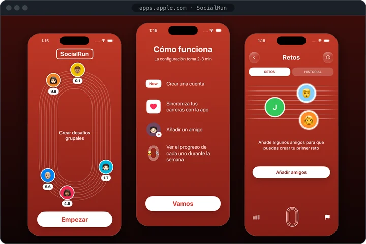
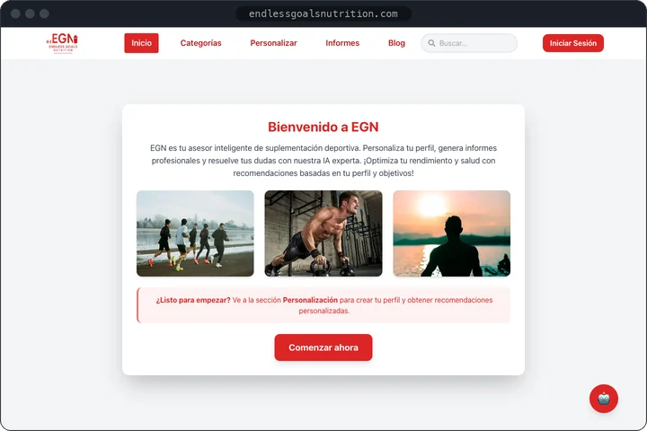
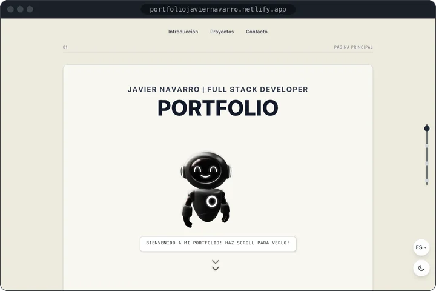

<picture>
  <source media="(prefers-color-scheme: dark)" srcset="imagenes/hero-dark.svg">
  <source media="(prefers-color-scheme: light)" srcset="imagenes/hero-light.svg">
  
</picture>

<b>EN</b> · Full Stack Developer based in Granada, Spain. I build web products with Next.js, React and TypeScript, and iOS apps with SwiftUI. Open to remote opportunities.

## `$ whoami`

Soy Javier, desarrollador full stack en Granada. Construyo productos web completos: la interfaz con React y Next.js, el backend con Node.js, Firebase o Supabase, los pagos con Stripe y las integraciones con IA. También he publicado en la App Store una app para iPhone y Apple Watch hecha con SwiftUI, y desarrollo módulos a medida para el ERP Dolibarr con PHP y MySQL.

Todos los proyectos de abajo están publicados y se pueden probar.

## `$ ls ~/proyectos`

<table>
  <tr>
    <td width="33%" valign="top">
       
      <b>AIFinder</b> 
      Directorio de herramientas de IA en español, con comparativas, precios y newsletter. 
      <code>Next.js</code> <code>Firebase</code> <code>Resend</code> <code>Cypress</code> 
      <a href="https://www.aifinder.es">Web</a> · <a href="https://github.com/JavierNavarro12/web_next.js">Código</a>
    </td>
    <td width="33%" valign="top">
       
      <b>SecureScan</b> 
      Detecta API keys expuestas, archivos sensibles y cabeceras inseguras en tu web. 
      <code>Next.js</code> <code>Supabase</code> <code>Stripe</code> <code>Puppeteer</code> 
      <a href="https://securescan-eight.vercel.app">Web</a> · <a href="https://github.com/JavierNavarro12/securescan">Código</a>
    </td>
    <td width="33%" valign="top">
       
      <b>CancelaYa</b> 
      Sube tu extracto bancario y descubre las suscripciones que sigues pagando. 
      <code>Next.js</code> <code>OpenAI</code> <code>Firebase</code> <code>Stripe</code> 
      <a href="https://cancela-ya.vercel.app">Web</a> · <a href="https://github.com/JavierNavarro12/cancelaya">Código</a>
    </td>
  </tr>
  <tr>
    <td width="33%" valign="top">
       
      <b>SocialRun</b> 
      App de running para iPhone y Apple Watch, con retos semanales entre amigos. 
      <code>SwiftUI</code> <code>SwiftData</code> <code>Supabase</code> <code>HealthKit</code> 
      <a href="https://apps.apple.com/es/app/socialrun/id6754617429">App Store</a> · <a href="https://github.com/JavierNavarro12/RunAmigos">Código</a>
    </td>
    <td width="33%" valign="top">
       
      <b>EGN</b> 
      Asesor de suplementación deportiva con IA: recomendaciones, informes y chat. 
      <code>React</code> <code>Firebase</code> <code>OpenAI</code> <code>Cypress</code> 
      <a href="https://endlessgoalsnutrition.com">Web</a> · <a href="https://github.com/JavierNavarro12/Fitness">Código</a>
    </td>
    <td width="33%" valign="top">
       
      <b>Portfolio</b> 
      Más proyectos, también los que no tienen código público. 
      <code>React</code> <code>Vite</code> <code>GSAP</code> <code>Spline</code> 
      <a href="https://portfoliojaviernavarro.netlify.app">Web</a> · <a href="https://github.com/JavierNavarro12/portfolio">Código</a>
    </td>
  </tr>
</table>

## `$ cat stack.yml`

<table>
  <tr>
    <td><code>├─ frontend:</code></td>
    <td>
      <picture><source media="(prefers-color-scheme: light)" srcset="https://skillicons.dev/icons?i=react%2Cnextjs%2Cts%2Cjs%2Ctailwind%2Chtml%2Ccss&theme=light"></picture> 
      React · Next.js · TypeScript · JavaScript · Tailwind · HTML · CSS
    </td>
  </tr>
  <tr>
    <td><code>├─ backend:</code></td>
    <td>
      <picture><source media="(prefers-color-scheme: light)" srcset="https://skillicons.dev/icons?i=nodejs%2Cphp%2Cfirebase%2Csupabase%2Cpostgres%2Cmysql&theme=light"></picture> 
      Node.js · PHP · Firebase · Supabase · PostgreSQL · MySQL · Stripe
    </td>
  </tr>
  <tr>
    <td><code>├─ móvil:</code></td>
    <td>
      <picture><source media="(prefers-color-scheme: light)" srcset="https://skillicons.dev/icons?i=swift%2Capple&theme=light"></picture> 
      SwiftUI · SwiftData · HealthKit · iOS · watchOS
    </td>
  </tr>
  <tr>
    <td><code>├─ calidad:</code></td>
    <td>
      <picture><source media="(prefers-color-scheme: light)" srcset="https://skillicons.dev/icons?i=jest%2Ccypress%2Cgithubactions&theme=light"></picture> 
      Jest · Cypress · GitHub Actions
    </td>
  </tr>
  <tr>
    <td><code>└─ herramientas:</code></td>
    <td>
      <picture><source media="(prefers-color-scheme: light)" srcset="https://skillicons.dev/icons?i=git%2Cgithub%2Cdocker%2Cvercel%2Cnetlify%2Cfigma%2Cvscode&theme=light"></picture> 
      Git · GitHub · Docker · Vercel · Netlify · Figma · VS Code
    </td>
  </tr>
</table>

## `$ contact`

Si tienes una propuesta o quieres comentar algún proyecto, escríbeme.

<table>
  <tr><td><code>portfolio</code></td><td><a href="https://portfoliojaviernavarro.netlify.app">portfoliojaviernavarro.netlify.app</a></td></tr>
  <tr><td><code>linkedin</code></td><td><a href="https://www.linkedin.com/in/javier-navarro-rodr%C3%ADguez-056023331/">javier-navarro-rodríguez</a></td></tr>
  <tr><td><code>email</code></td><td><a href="mailto:navarrojavi107@gmail.com">navarrojavi107@gmail.com</a></td></tr>
</table>
